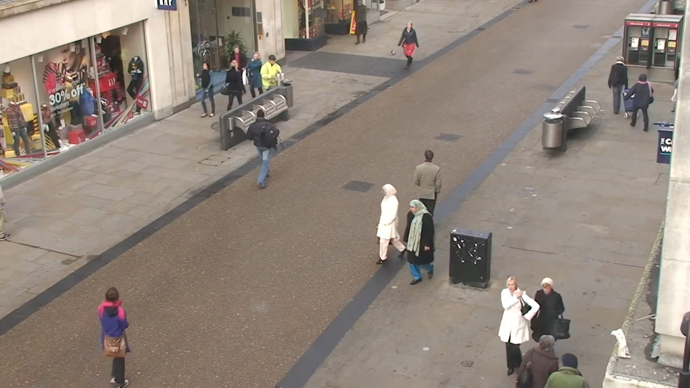

Parte 3 - SAVI
=============
Miguel Riem Oliveira <mriem@ua.pt>
2022-2023

# Sumário

- Processamento de vídeo

# Exercícios

## Exercício 1 - Controlo de tráfego

Utilize o vídeo **traffic.mp4** para fazer um sistema de contagem de veículos.
O objetivo é saber quantos veículos passaram.

## Exercício 2 - Controlo de tráfego

Obtenha a contagem separada para cada faixa de rodagem.

## Exercício 3 - Cor

O programa deve imprimir um relatório com os eventos de passagem de veículos, com a faixa de rodagem e a cor do veículo.

## Exercício 4 - Seguimento

O programa deve poder pausar o vídeo para que o utilizador indique um retângulo na imagem através do rato. Depois, o objeto presente nesse quadrado deverá ser seguido ao longo do vídeo.

Um exemplo [aqui](https://broutonlab.com/blog/opencv-object-tracking).

## Exercício 5 - Vigilância

Utilizando o dataset [OxfordTownCentre](https://academictorrents.com/details/35e83806d9362a57be736f370c821960eb2f2a01), crie um programa que faça a deteção de pedestres e mostre caixas à volta das pessoas.

