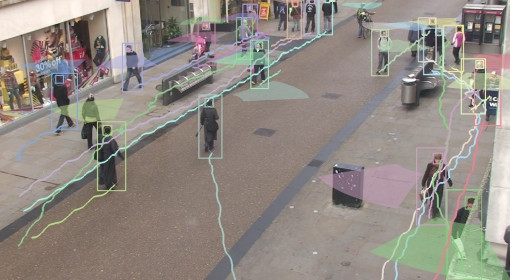

Parte 4 - SAVI
=============
Miguel Riem Oliveira <mriem@ua.pt>
2022-2023

# Sumário

- Seguimento.

# Exercícios

## Exercício 1 - Seguimento

O programa deve poder pausar o vídeo para que o utilizador indique um retângulo na imagem através do rato. Depois, o objeto presente nesse quadrado deverá ser seguido ao longo do vídeo.

Um exemplo [aqui](https://broutonlab.com/blog/opencv-object-tracking).

## Exercício 2 - Vigilância

Utilizando o dataset [OxfordTownCentre](https://academictorrents.com/details/35e83806d9362a57be736f370c821960eb2f2a01), crie um programa que faça a deteção de pedestres e mostre caixas à volta das pessoas.

## Exercício 3 - Anotações Ground Truth

Crie um script para processar a informação disponibilizada no dataset, desenhando as caixas dos corpos de cada pessoa e a sua trajetória.

